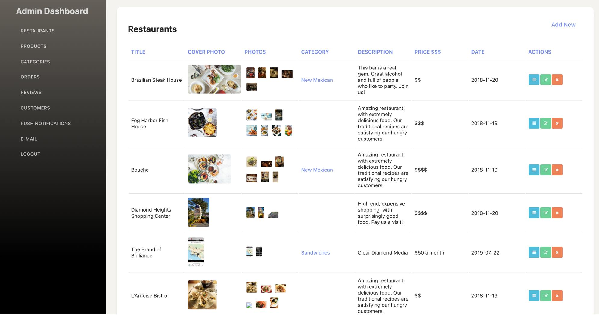
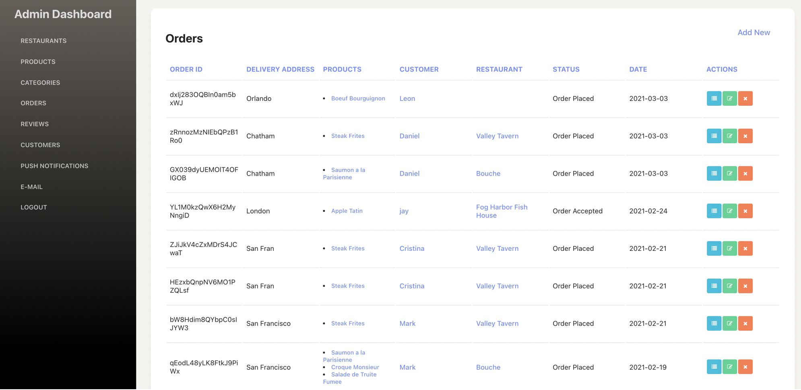
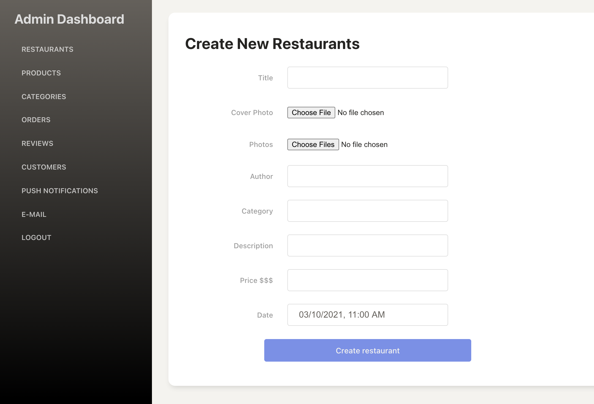

#Clone Ubereats mobile and admin dashboard 

The UberEats Clone application is a comprehensive solution for building a food delivery marketplace platform. Developed using React Native, it offers fully functional mobile apps for three key roles: customers, delivery drivers, and restaurant owners. The application is optimized for both iOS and Android platforms, ensuring a seamless user experience across devices.

Key Features:
1. UberEats Clone App: This app serves as the customer-facing platform, allowing users to browse through various restaurants, explore menus, place orders, track deliveries, and make payments using Stripe integration. It provides a user-friendly interface with over 70 functional screens to enhance the overall user experience.

2. Delivery Boy (Driver) App: The Delivery Boy app is designed for delivery drivers to manage their deliveries efficiently. It includes features like order acceptance, route optimization, real-time tracking, order completion updates, and push notifications to ensure smooth communication between drivers and customers.

3. Restaurant Dashboard App: This app empowers restaurant owners to manage their online presence effectively. It offers features like menu management, order acceptance, order tracking, and order completion updates. Restaurant owners can efficiently handle incoming orders and streamline their operations using this intuitive dashboard.

4. Firebase Backend Integration: The application is integrated with Firebase, a powerful backend platform. Firebase Firestore is used for managing data storage, Firebase Storage for handling media assets, and Firebase Cloud Messaging for sending push notifications to users.

5. Stripe Payments Integration: The app leverages Stripe payment gateway integration, allowing customers to securely make payments for their orders within the application.\

6. Web Admin Panel in ReactJs & Node.js: The web admin panel provides an interface for system administrators to manage the UberEats Clone platform effectively. It includes functionalities such as user management, order management, analytics, and reporting.\

7. Modularized Codebase: The codebase has been structured in a modular manner, allowing easy adaptation for different types of multi-vendor delivery services. Whether it's grocery delivery, flower delivery, alcohol delivery, or pharmacy delivery, the app can be customized to suit various business models.\

8. Email Integration with SendGrid: The application incorporates SendGrid for seamless email integration, enabling functionalities such as order confirmations, order updates, and promotional emails.\

9. Backend Functionality: The backend functionalities include dispatching orders to restaurants and drivers, order completion tracking, order tracking updates for customers, and push notifications to keep all parties informed about the order status.\

10. Extensibility: The UberEats Clone application can be easily customized and extended to create clones of other popular food delivery apps, such as Doordash, Postmates, Deliveroo, Grubhub, Food Panda, Yelp Eats24, Caviar, Just Eat Takeaway, Swiggy, and Gojek.\

Overall, the UberEats Clone application in React Native offers a feature-rich and scalable solution for building a multi-vendor food delivery platform, providing a seamless experience for customers, delivery drivers, and restaurant owners.\

#Video Preview of Final UI

#Screens it contains:\

=> UberEats Clone (Consumer app)\

=> Driver App\

=> Restaurant Admin App\

=> Admin Dashboard for React Native UberEats App\

Please note that Clone uberteats is a customized application developed for a specific client, sharing the source code may not be feasible due to confidentiality and intellectual property reasons. However, the provided description outlines the key functionalities and features of the application.
**feel free to contact us : https://wa.me/21654120687 or chahedmoetaz@gmail.com  **
## Photos
\
\
\
\
